[English](./README.md)

## :rocket: 如果有帮助，点个star！:star: ##

### 移动端NCNN部署，项目支持YOLOv5s、YOLOv4-tiny、MobileNetV2-YOLOv3-nano、Simple-Pose、Yolact、ChineseOCR-lite、ENet、Landmark106、DBFace、MBNv2-FCN与MBNv3-Seg-small模型，摄像头实时捕获视频流进行检测。

## iOS:
- Xcode 12.4
- macOS 11.2.3
- iPhone 6sp 13.5.1

## Android:
- Android Studio 4.1
- Win10 20H2
- CPU:Qualcomm 710 GPU:Adreno 616

> iOS
```code
从界面中选择需要测试的模型。
```
> Android
```
从界面中选择需要测试的模型。
```
### 模型
| model | android | iOS | from | other |
|-------------------|:--------:|:--------:|:--------:|:--------:|
| YOLOv5s           | yes | yes |  [Github](https://github.com/ultralytics/yolov5)   | [TNN](https://github.com/cmdbug/TNN_Demo) |
| YOLOv4-tiny       | yes | yes |  [Github](https://github.com/ultralytics/yolov3)   |
| YOLOv3-nano       | yes | yes |  [Github](https://github.com/dog-qiuqiu/MobileNet-Yolo)   |
| YOLOv5s_custom_op | yes | yes |  [zhihu](https://zhuanlan.zhihu.com/p/275989233)   |
| NanoDet           | yes | yes |  [Github](https://github.com/RangiLyu/nanodet)   | [TNN](https://github.com/cmdbug/TNN_Demo) [MNN](https://github.com/cmdbug/MNN_Demo) |
| YOLO-Fastest-xl   | yes | yes |  [Github](https://github.com/dog-qiuqiu/Yolo-Fastest)   |
| Simple-Pose       | yes | yes |  [Github](https://github.com/dog-qiuqiu/MobileNet-Yolo)   |
| Yolact            | yes | yes |  [Github](https://github.com/dbolya/yolact) [zhihu](https://zhuanlan.zhihu.com/p/128974102)  |
| ChineseOCR_lite   | yes | yes |  [Github](https://github.com/ouyanghuiyu/chineseocr_lite) [zhihu](https://zhuanlan.zhihu.com/p/113338890)   |
| ENet              | bug | cancel |  [Github](https://github.com/davidtvs/PyTorch-ENet)   |
| Landmark106       | yes | yes |  [Github](https://github.com/dog-qiuqiu/MobileNet-Yolo)   |
| DBFace            | yes | yes |  [Github](https://github.com/yuanluw/DBface_ncnn_demo)   |
| MBNv2-FCN         | yes | yes |  [Github](https://github.com/open-mmlab/mmsegmentation)   |
| MBNv3-Seg-small   | yes | yes |  [Github](https://github.com/Tramac/Lightweight-Segmentation)   |
| Light_OpenPose    | yes | yes |  [Github](https://github.com/Daniil-Osokin/lightweight-human-pose-estimation.pytorch)   |


### iOS:
- 从 "android_YOLOV5_NCNN\app\src\main\assets" 复制 .param 和 .bin 文件到 "iOS_YOLOv5NCNN\YOLOv5NCNN\res" 下。
- iOS如果提示 net.h 找不到的需要去ncnn官网下载或自行编译.framework(20201208)替换到工程中，opencv2.framework(4.3.0)如果有用到也需要重新下载并替换到工程。
- iOS默认使用的库不包含vulkan与bitcode。
- 正常下需要重新下载 ncnn.framework/glslang.framework/openmp.framework/opencv2.framework 并替换到工程中。
- Vulkan的配置可以看 Issues 里面有提到大概的配置。

### Android：
* 由于手机性能、图像尺寸等因素导致FPS在不同手机上相差比较大。该项目主要测试NCNN框架的使用，具体模型的转换可以去NCNN官方查看转换教程。<br/>
* 由于opencv库太大只保留 arm64-v8a/armeabi-v7a 有需要其它版本的自己去官方下载。
* ncnn暂时使用vulkan版本，在加载前需要打开加速，本项目中没有打开。如果要用ncnn版本需要修改CMakeLists.txt配置。
* AS版本不一样可能编译会有各种问题，如果编译错误无法解决、建议使用AS4.0以上版本尝试一下。
* ncnn已经更新到新版本，即包含 ncnn.cmake 的官方导入方式。

该项目更多的是练习各种模型的使用与部署，在速度上没有过多处理。如果对速度有要求可以直接获取 YUV 等数据直接输入或使用 texture 与 opengl 等方式实现数据输入，减少中间的数据传输与转换。

懒人本地转换(不会上传模型): [xxxx -> ncnn](https://convertmodel.com/)

轻量级OpenCV:[opencv-mobile](https://github.com/nihui/opencv-mobile)

:art: 截图<br/>

| Android | iOS |
|:-----:|:-----:|
|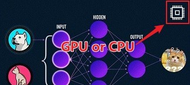| 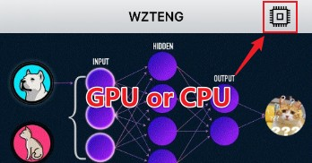 |

> Android

| mbnv2-yolov3-nano | yolov4-tiny | yolov5s |
|-------------------|-------------|---------|
|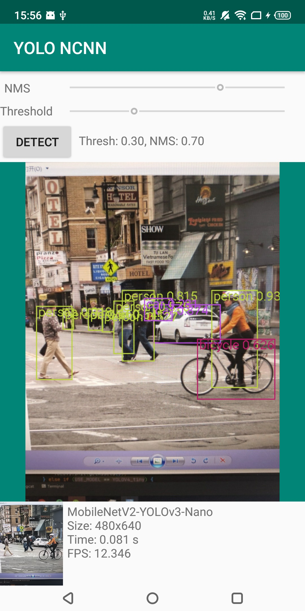||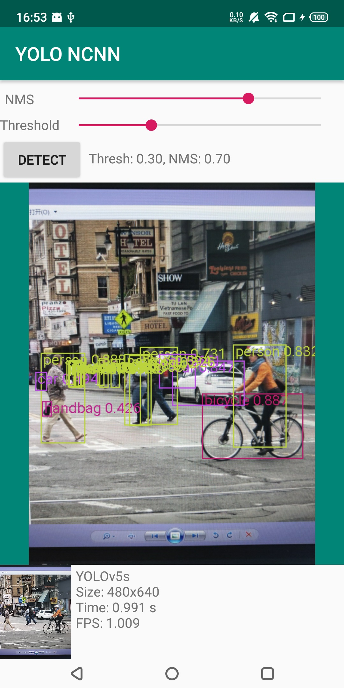|

| simple_pose | yolact | chineseocr_lite_01 |
|-------------------|-------------|---------|
|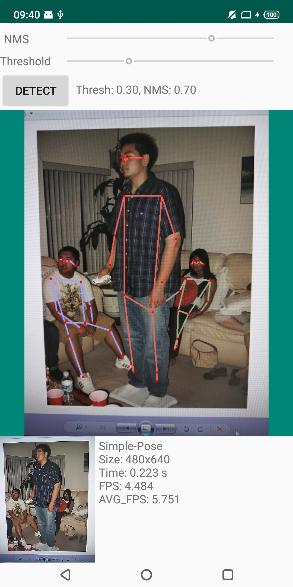|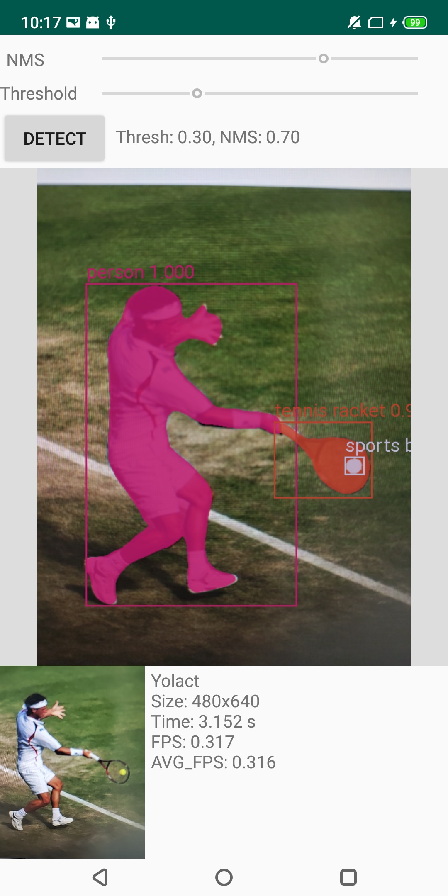|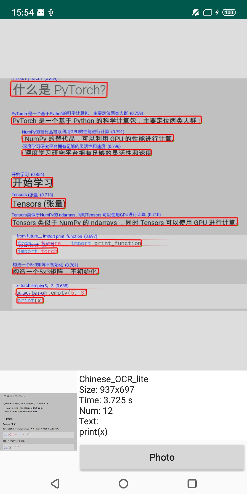|

| chineseocr_lite_02 | ENet | yoloface500k-landmark106 |
|-------------------|-------------|---------|
|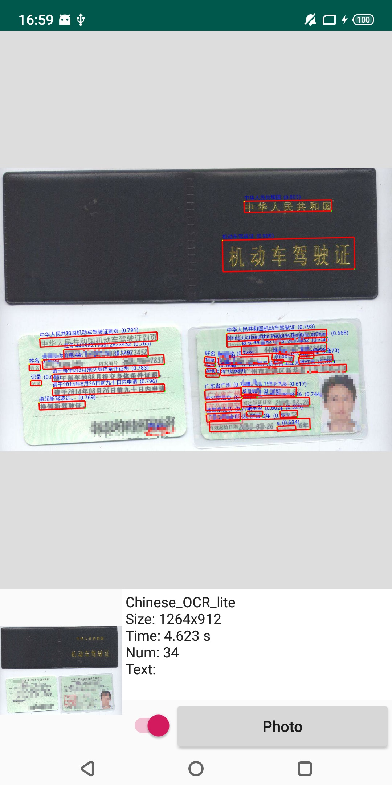|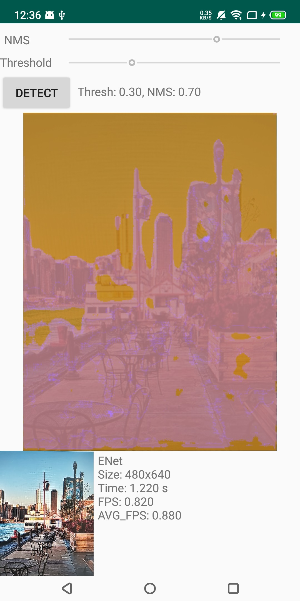|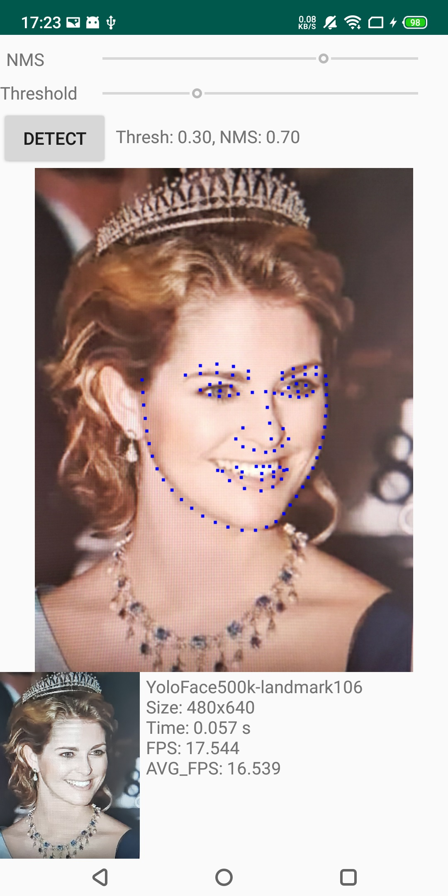|

|  dbface | mbnv2_fcn | mbnv3_seg_small |
|-------------------|-------------|---------|
| 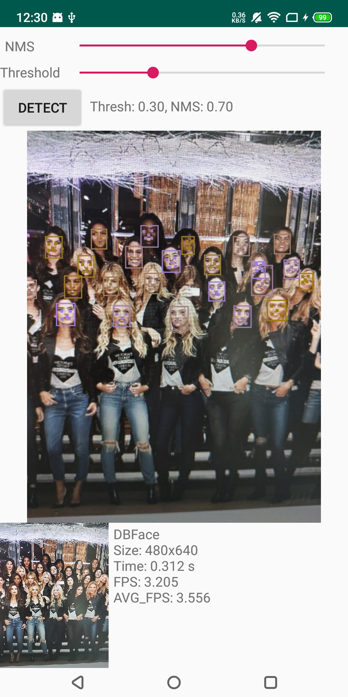|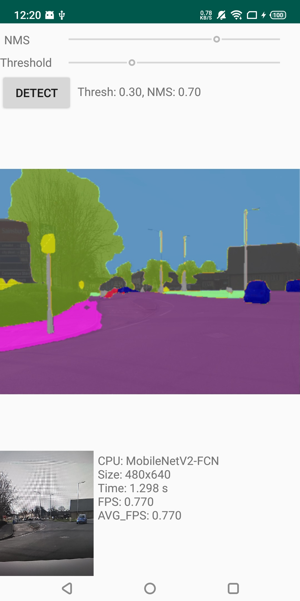|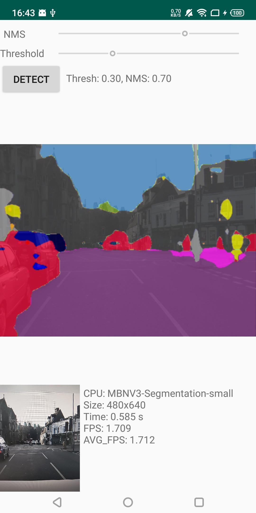|

|  yolov5s_custom_op | nanodet | yolo-fastest-xl |
|-------------------|-------------|---------|
| 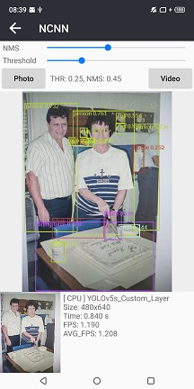|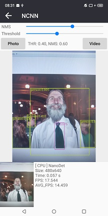|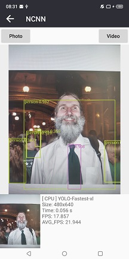|

|  light_openpose  |
|-------------------|
| 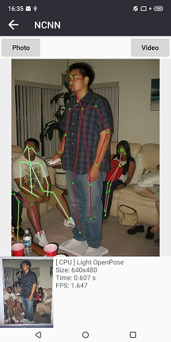|


> iOS

|  mbnv2-yolov3-nano | yolov4-tiny | yolov5s |
|-------------------|-------------|---------|
| 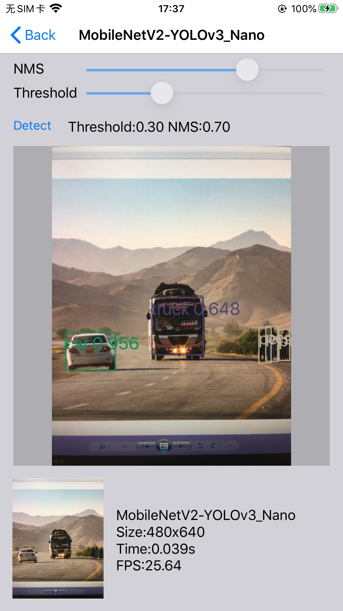 |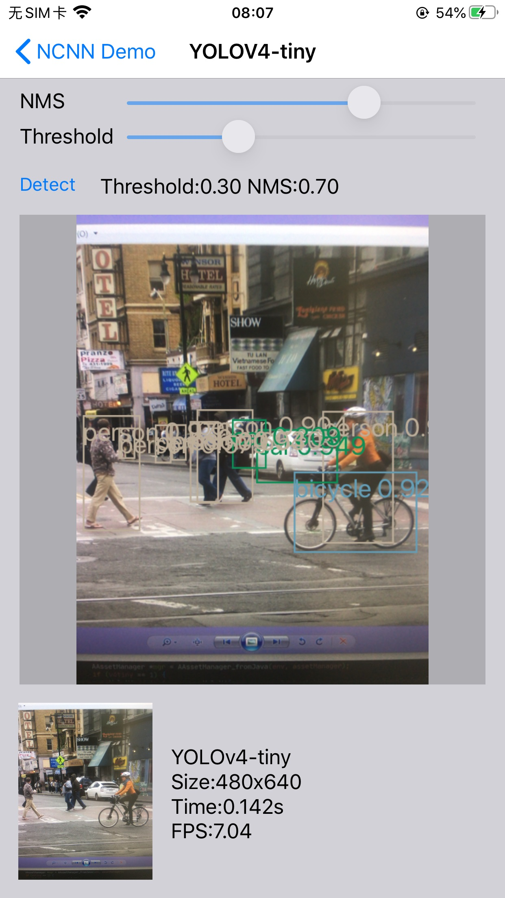| 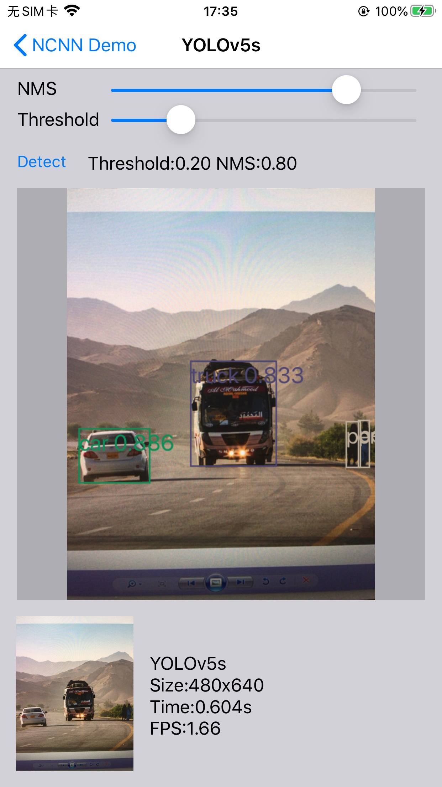 |

|  yolov5s_custom_op | nanodet | yolo-fastest-xl |
|-------------------|-------------|---------|
| 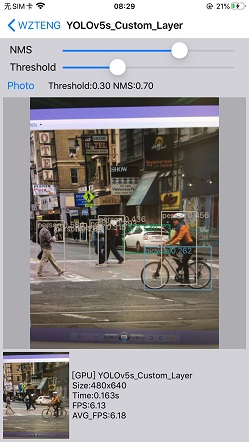 | 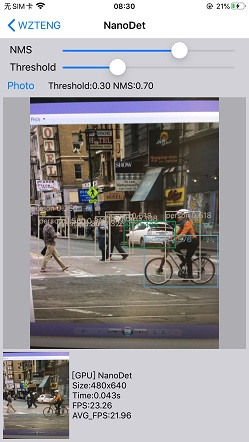 |  |

|  mbnv2_fcn | mbnv3_seg_small | simple_pose |
|-------------------|-------------|---------|
| 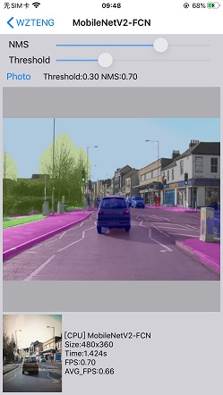 | 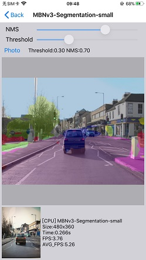 |  |

| chineseocr_lite_01 | chineseocr_lite_02 | light_openpose |
|-------------------|-------------|---------|
| 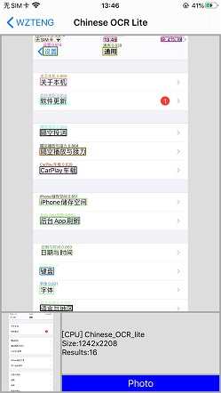 | 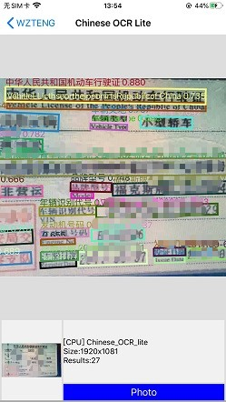 | 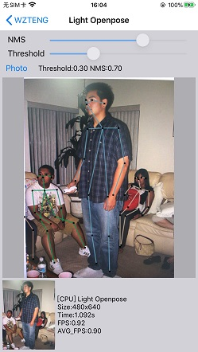 |

|  yolact | yoloface500k-landmark106 | dbface |
|-------------------|-------------|---------|
|  | 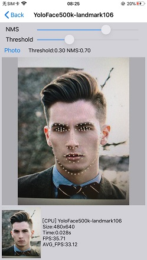 | 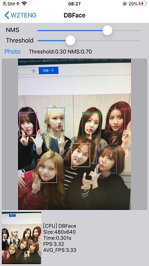 |


感谢:<br/>
- sunnyden, dog-qiuqiu, ..., nihui
- https://github.com/Tencent/ncnn

